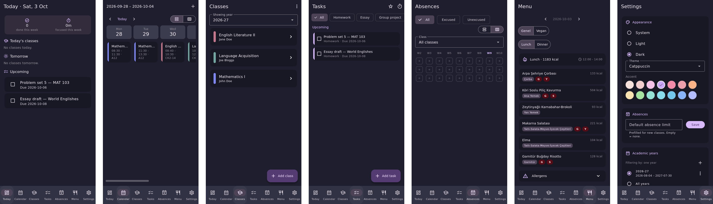

# Chronicle

Cross-platform student planner: class schedules, absences, tasks and exams, a focus timer, and dining-hall menus.

## Screenshots

Catppuccin Mocha with the Mauve accent.

## Install

Get the latest release from Releases:

## Changelog

See [CHANGELOG.md](CHANGELOG.md).
